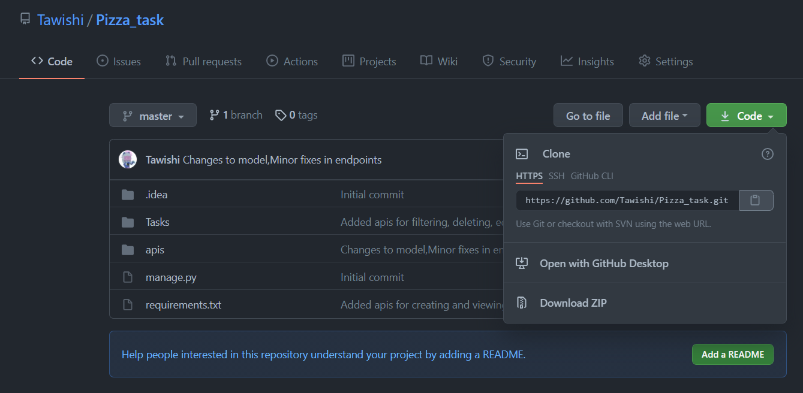
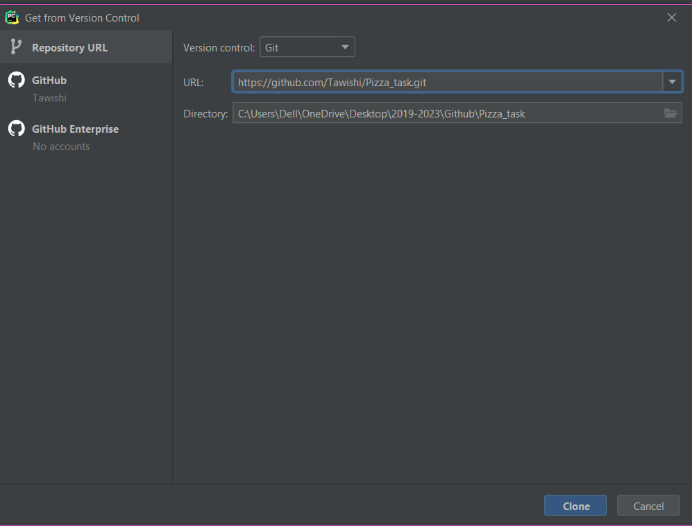
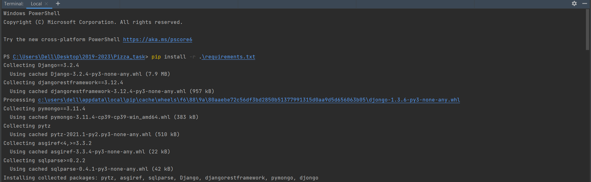
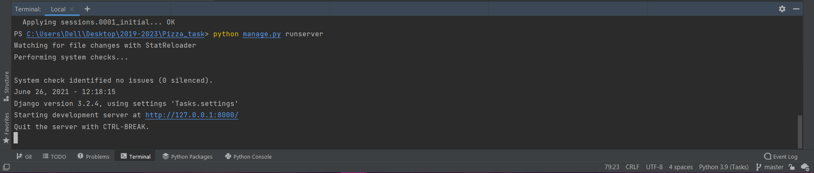

### Running the project in Django

1. Clone the project
   
   
2. Install the requirements
   
3. Connect to MongoDB<br>
4. Make migrations
   
5. Run server
   
6. Start testing the endpoints (in Postman)

The API endpoints were tested in [Postman](https://www.getpostman.com/collections/c05ea3bf772c24c1eecb)
<details>
<summary>Create Pizza</summary>

#### Introduction :

API endpoint for creating a pizza.

#### Endpoint :

```POST``` <a href = "http://127.0.0.1:8000/create_pizza/">create_pizza/</a>

#### Request :

| Key   |  Datatype |Description   |
| ------------ | ------------ | ------------ |
| type | string | Required, Valid(R,S) |
| size | string | Required |
| toppings | string | Required |

#### Sample request body:

```json
type:S
size: small
toppings: onions tomatoes things
```

#### Errors :

* ```Serializer error```  : Check the input provided for corrections

#### Example responses :


<center><i>Serializer error</i></center>


<center><i>Pizza created</i></center>
</details>

<details>
<summary>View pizzas</summary>

#### Introduction :

API endpoint for viewing pizzas.

#### Endpoint :

```GET``` <a href = "http://127.0.0.1:8000/view_pizza/">view_pizza/</a>

#### Request :

No request body needed.

#### Example responses :


<center><i>Pizzas viewed</i></center>
</details>

<details>
<summary>Filter pizzas</summary>

#### Introduction :

API endpoint for filtering pizzas.

#### Endpoint :

```POST``` <a href = "http://127.0.0.1:8000/filter_pizza/">filter_pizza/</a>

#### Request :

| Key   |  Datatype |Description   |
| ------------ | ------------ | ------------ |
| type | string | Required, Valid(R,S) |
| size | string | Required |

#### Sample request body:

```json
type:S
size: small
```

#### Errors :

* ```Serializer error```  : Check the input provided for corrections

#### Example responses :


<center><i>Serializer error</i></center>


<center><i>Pizzas filtered</i></center>
</details>

<details>
<summary>Edit pizzas</summary>

#### Introduction :

API endpoint for editing a pizza.

#### Endpoint :

```PUT``` <a href = "http://127.0.0.1:8000/edit_pizza/">edit_pizza/</a>

#### Request :

| Key   |  Datatype |Description   |
| ------------ | ------------ | ------------ |
| id | int | Required, Valid |
| size | string | Required, None allowed |
| toppings | string | Required, None allowed |

#### Sample request body:

```json
id:1
size: medium
type:
```

#### Errors :

* ```Key-value error```  : Check the input provided for corrections

#### Example responses :


<center><i>Key-value error</i></center>


<center><i>Pizza edited</i></center>
</details>

<details>
<summary>Delete pizzas</summary>

#### Introduction :

API endpoint for deleting a pizza.

#### Endpoint :

```DELETE``` <a href = "http://127.0.0.1:8000/delete_pizza/">delete_pizza/</a>

#### Request :

| Key   |  Datatype |Description   |
| ------------ | ------------ | ------------ |
| id | int | Required, Valid |

#### Sample request body:

```json
id : 1
```

#### Errors :

* ```Key-value error```  : Check the input provided for corrections

#### Example responses :


<center><i>Key-value error</i></center>


<center><i>Pizza deleted</i></center>
</details>